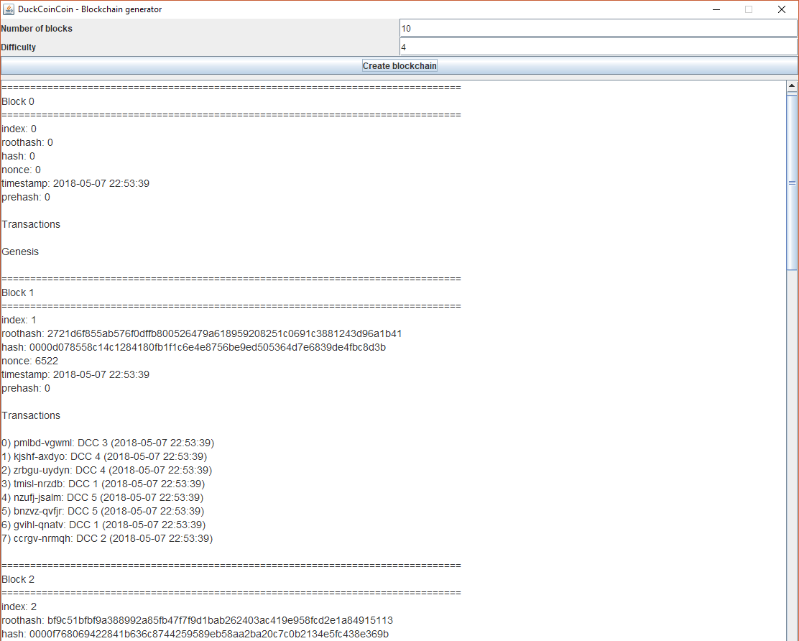

# DuckCoinCoin

Create a blockchain generator from scratch.

Project of object-oriented second-year Computer Science degree at Paul Sabatier University.

# Features

* Generate a random blockchain with random transactions
* Verify the integrity of the blockchain by mining blocks again and recomputing the merkle root
* Export the generated blockchain to a JSON file
* Import a blockchain from a JSON file

# How to use?

For the moment the only way of running this is:

1. [Download all the source code](https://github.com/togademi/DuckCoinCoin/archive/master.zip)
2. Run `src/blockchain/UI/BlockChainMain.java` with a Java IDE or whatever
    - Warning: this only lets you generate random blockchains. No JSON export/import

**Or** run `src/blockchain/App.java` and mess with the `main` method if you want to:

* Export/import a JSON file
* Corrupt the blockchain by modifying it (and the blockchain would verify its integrity)

# Screenshots

## Built With

* [Eclipse](https://www.eclipse.org/) - The Java IDE I used

# Authors

* [Tomás García de Miguel](https://github.com/togademi) - *Source code*
* [Aubin Clerc](https://github.com/Sunibo) - *User interface*

# License

This project is licensed under the MIT License - see the [LICENSE.md](./LICENSE.md) file for details

## Final and most important information

### 💰 Why coin?

Because this is a blockchain generator, and they're mainly used to manage money.

### 🦆 Why duck?

Because "coin" is the sound that ducks make in French.
